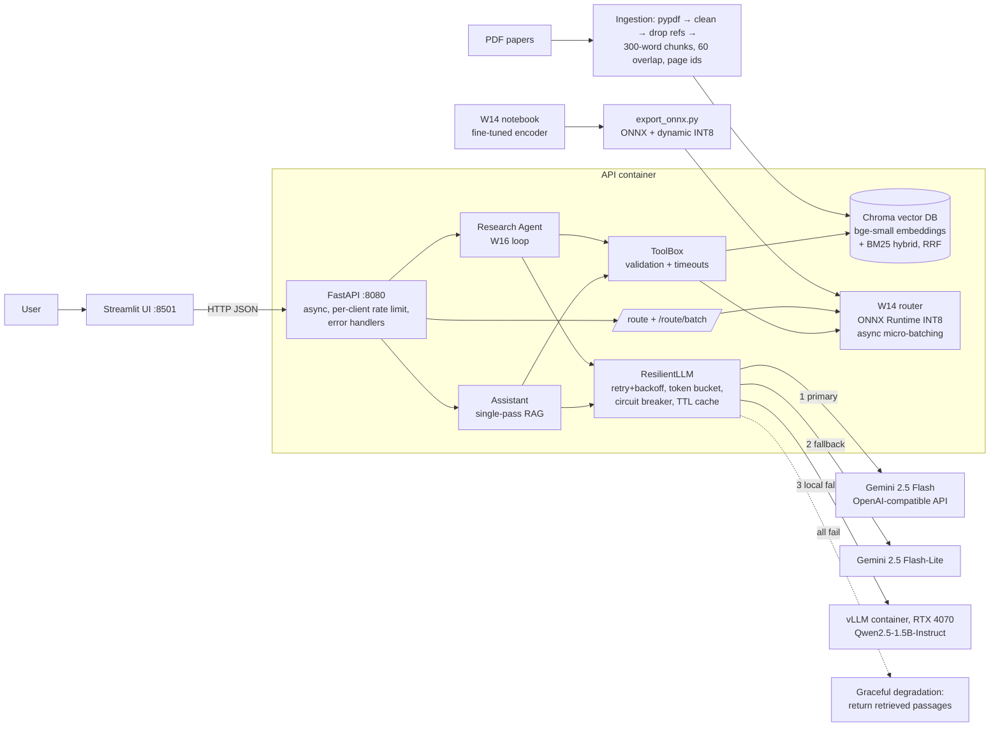
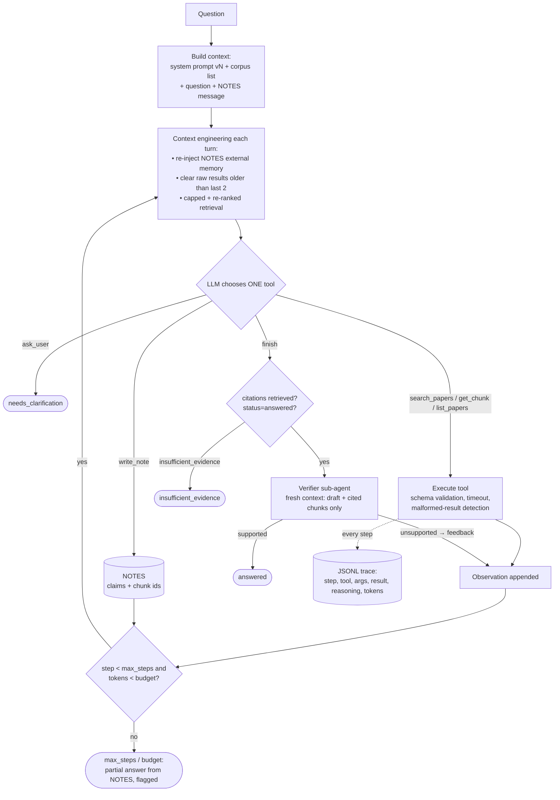
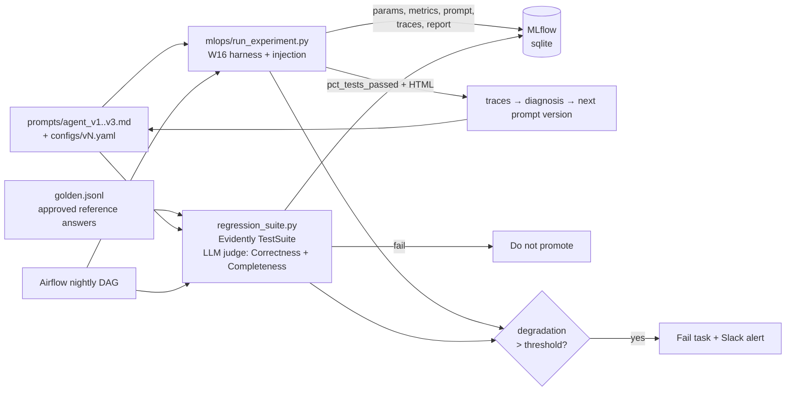

# Architecture

## W15: Assistant + productionisation

```mermaid
flowchart LR
  U[User] --> UI[Streamlit UI :8501]
  UI -->|HTTP JSON| API[FastAPI :8080<br/>async, per-client rate limit,<br/>error handlers]
  subgraph API_BOX[API container]
    API --> A[Assistant<br/>single-pass RAG]
    API --> AG[Research Agent<br/>W16 loop]
    API --> RT[/route + /route/batch/]
    A & AG --> TB[ToolBox<br/>validation + timeouts]
    TB --> VS[(Chroma vector DB<br/>bge-small embeddings<br/>+ BM25 hybrid, RRF)]
    TB --> ONNX[W14 router<br/>ONNX Runtime INT8<br/>async micro-batching]
    RT --> ONNX
    A & AG --> LLM[ResilientLLM<br/>retry+backoff, token bucket,<br/>circuit breaker, TTL cache]
  end
  LLM -->|1 primary| G1[Gemini 2.5 Flash<br/>OpenAI-compatible API]
  LLM -->|2 fallback| G2[Gemini 2.5 Flash-Lite]
  LLM -->|3 local fallback| V[vLLM container, RTX 4070<br/>Qwen2.5-1.5B-Instruct]
  LLM -.all fail.-> D[Graceful degradation:<br/>return retrieved passages]
  P[PDF papers] --> ING[Ingestion: pypdf → clean → drop refs →<br/>300-word chunks, 60 overlap, page ids] --> VS
  W14[W14 notebook<br/>fine-tuned encoder] --> EXP[export_onnx.py<br/>ONNX + dynamic INT8] --> ONNX
```

## W16: Agentic loop (single agent + independent verifier sub-agent)

```mermaid
flowchart TD
  Q[Question] --> CTX[Build context:<br/>system prompt vN + corpus list<br/>+ question + NOTES message]
  CTX --> CE[Context engineering each turn:<br/>• re-inject NOTES external memory<br/>• clear raw results older than last 2<br/>• capped + re-ranked retrieval]
  CE --> LLM{LLM chooses ONE tool}
  LLM -->|search_papers / get_chunk / list_papers| T[Execute tool<br/>schema validation, timeout,<br/>malformed-result detection] --> OBS[Observation appended] --> STOP
  LLM -->|write_note| N[(NOTES<br/>claims + chunk ids)] --> STOP
  LLM -->|ask_user| CL([needs_clarification])
  LLM -->|finish| F{citations retrieved?<br/>status=answered?}
  F -->|yes| VER[Verifier sub-agent<br/>fresh context: draft + cited chunks only]
  VER -->|supported| DONE([answered])
  VER -->|unsupported → feedback| OBS
  F -->|insufficient_evidence| IE([insufficient_evidence])
  STOP{step < max_steps and<br/>tokens < budget?} -->|yes| CE
  STOP -->|no| MX([max_steps / budget:<br/>partial answer from NOTES, flagged])
  T -.every step.-> TR[(JSONL trace:<br/>step, tool, args, result, reasoning, tokens)]
```

## W17 Track B: MLOps loop

```mermaid
flowchart LR
  PV[prompts/agent_v1..v3.md<br/>+ configs/vN.yaml] --> RX[mlops/run_experiment.py<br/>W16 harness + injection]
  RX -->|params, metrics, prompt,<br/>traces, report| MLF[(MLflow<br/>sqlite)]
  RX --> TR[traces → diagnosis → next prompt version]
  TR --> PV
  G[golden.jsonl<br/>approved reference answers] --> RS[regression_suite.py<br/>Evidently TestSuite<br/>LLM judge: Correctness + Completeness]
  PV --> RS
  RS -->|pct_tests_passed + HTML| MLF
  RS -->|fail| BLOCK[Do not promote]
  AF[Airflow nightly DAG] --> RX & RS --> CHK{degradation<br/>> threshold?} -->|yes| ALERT[Fail task + Slack alert]
```
